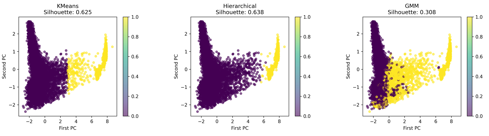
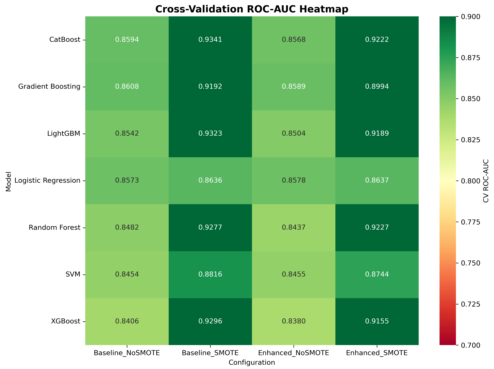
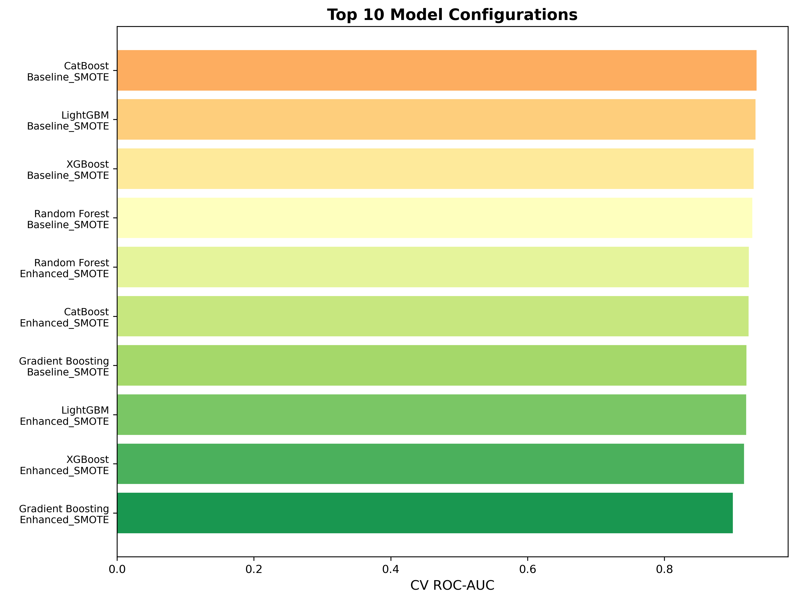
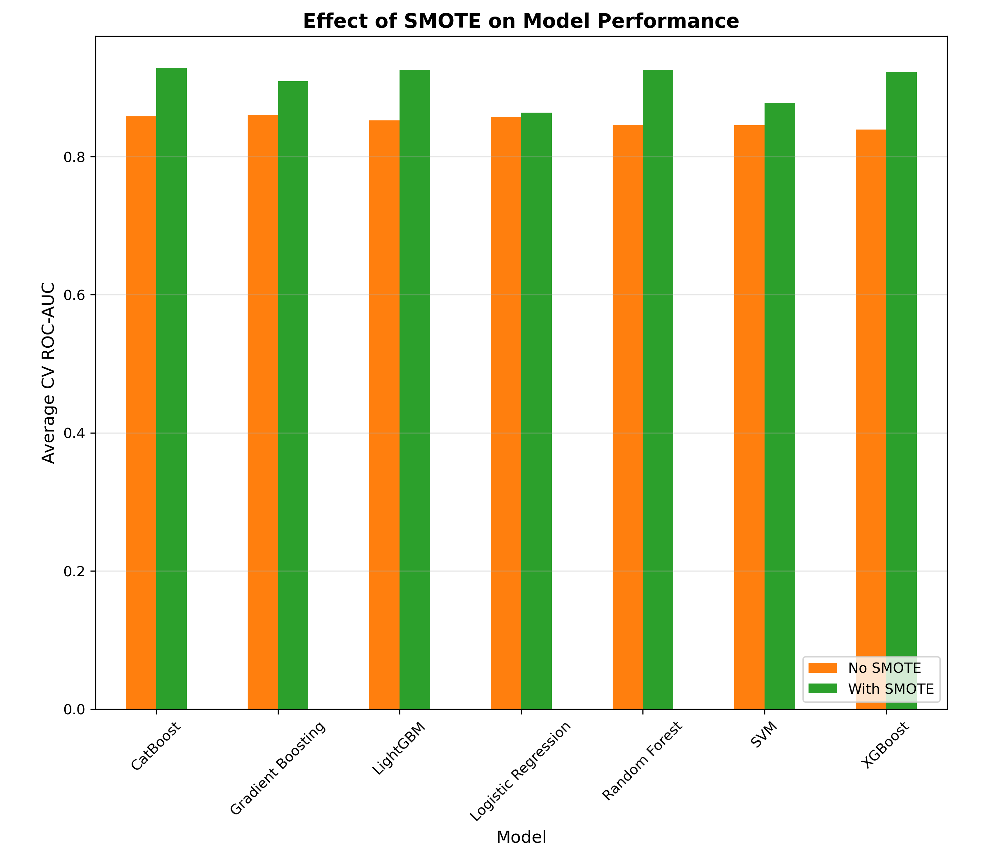
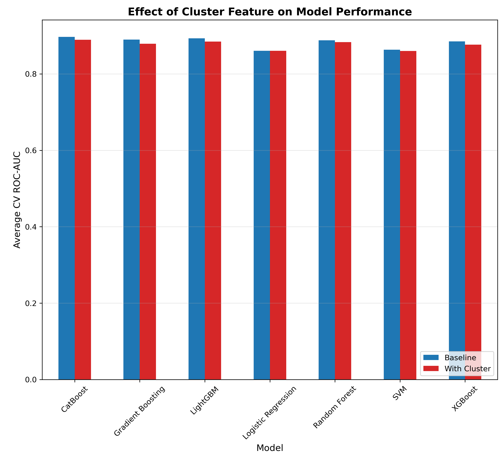
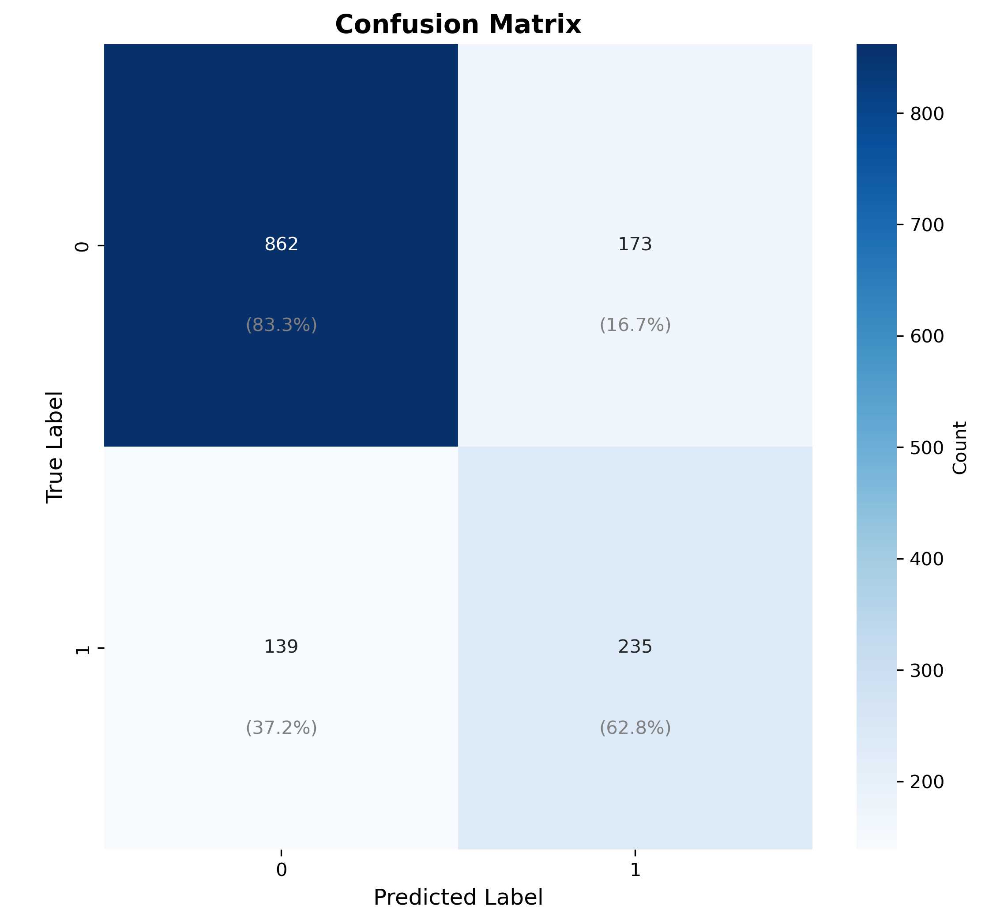
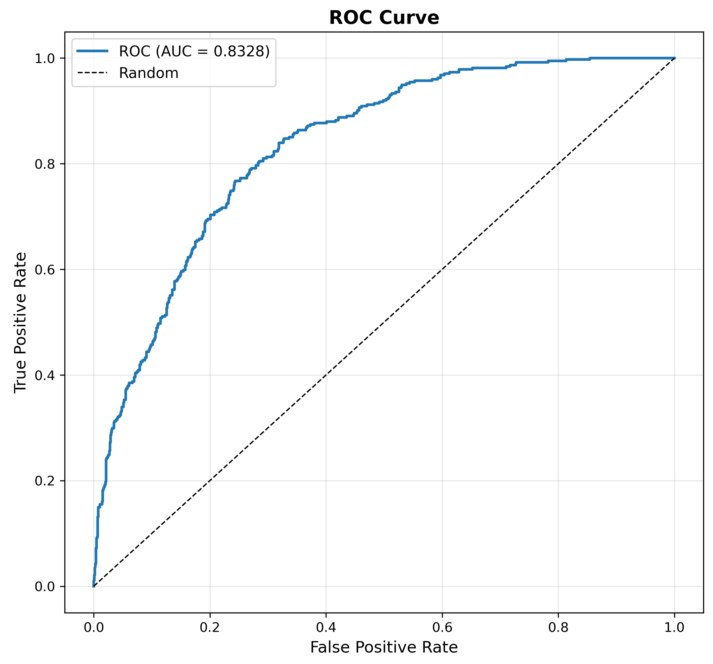
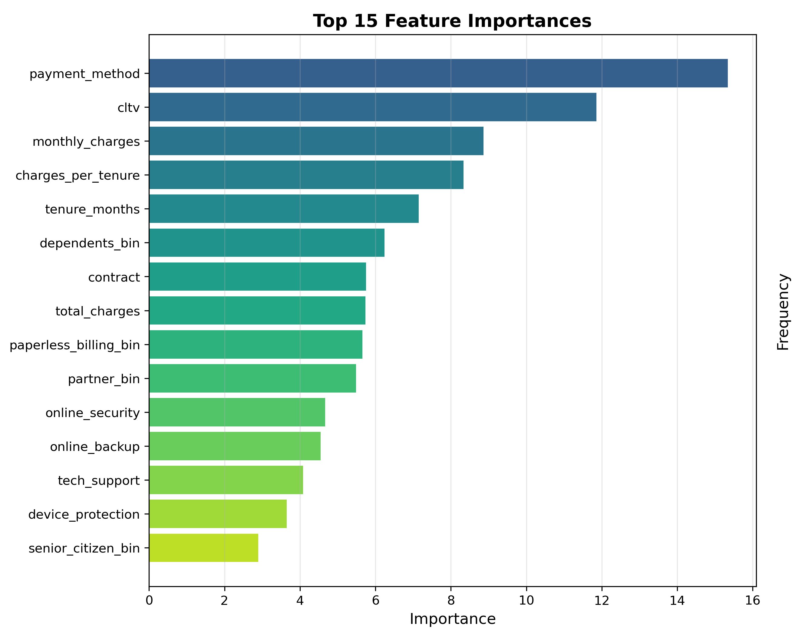
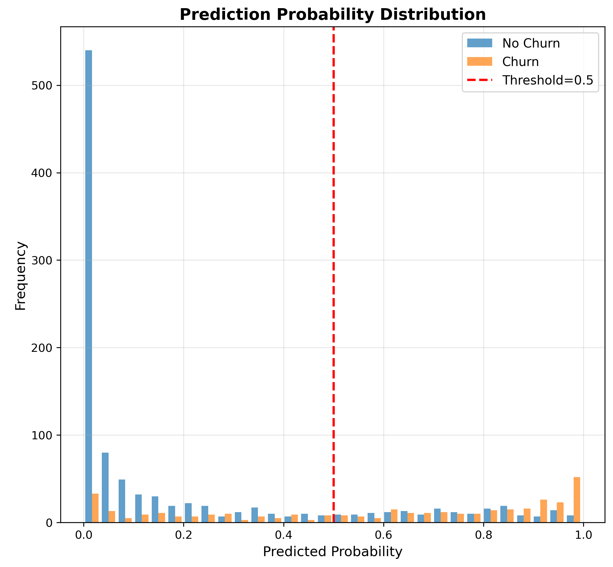

# ML_project_group_16.github.io

The members of Group 16 are: 
- Andrew Park
- Nikolaos Kakonas
- Rishikesh Donthula
- Saehee Eom 
- Tejas Khandwekar

This project explores supervised and unsupervised approaches for customer churn prediction using telecom customer data.

This repository hosts our final report for the ML course project.

The [website](https://github.gatech.edu/pages/tkhandwekar3/Ml_project_group_16.github.io/) is deployed using **GitHub Pages** and contains the full report, visualizations, and contribution table.

## Outline

- [1. Introduction / Background](#1-introduction--background)
- [2. Problem Definition](#2-problem-definition)
- [3. Methods](#3-methods)
- [4. Results and Discussion](#4-results-and-discussion)
- [5. Conclusion](#5-conclusion)
- [6. Next Steps](#6-next-steps)
- [7. References](#7-references)
- [8. Gantt Chart](#8-gantt-chart)
- [9. Contribution Table](#9-contribution-table)
- [10. Repository Structure](#10-repository-structure)

---

## **1\. Introduction / Background**

### **1.1 Problem Context**

Customer churn is one of the most critical challenges facing telecommunications companies. In a highly competitive market, customers can switch providers with minimal friction, making it essential for companies to understand which customers are likely to leave and why. Churn prediction is typically approached as a machine learning problem that integrates customer demographics, service usage, billing behavior, satisfaction scores, and geographic information.

In our project, we analyze a multi-source telecom dataset containing demographic, behavioral, geographic, and service-level attributes for thousands of customers. By combining supervised and unsupervised approaches, we aim not only to predict churn but also to uncover underlying customer groups and behavioral patterns that may indicate churn risk.

### **1.2 Importance of Churn Prediction in Telecom**

Retaining existing customers is significantly more cost-effective than acquiring new ones, making churn prediction a high-impact application of machine learning in the telecom industry. Accurate churn prediction models help allocate marketing budgets efficiently, enabling targeted retention campaigns, promotional offers, or customized service improvements. Beyond prediction, understanding the drivers of churn, such as billing issues, contract type, service subscriptions, or demographic factors, allows companies to design better customer experiences and improve long-term loyalty.

For telecom providers, even modest improvements in churn prediction lead to substantial financial benefits. This motivates our project’s dual focus on predictive performance and interpretability.

### **1.3 Summary of Related Research**

Recent research highlights the importance of machine learning in understanding and predicting customer churn in the telecommunications industry. Across studies, two themes consistently emerge: the effectiveness of advanced supervised learning models for churn prediction, and the value of unsupervised methods for analyzing customer behavior and segmenting churn risk.

Supervised learning remains the dominant approach. According to Sikri et al. [2], machine-learning–driven churn prediction significantly improves customer retention strategies in telecom, especially when models incorporate service usage, billing characteristics, and customer demographics. Shahabikargar et al. [3] provide a comprehensive survey showing that ensemble models, particularly gradient boosting algorithms such as XGBoost, LightGBM, and CatBoost, perform consistently better than classical methods, especially when handling complex categorical and behavioral features. Similarly, Imani et al. [1] demonstrate that boosting algorithms remain robust even under varying degrees of class imbalance, outperforming Random Forest across methods such as SMOTE, ADASYN, and GNUS. These findings motivate the use of advanced ensemble models in our project.

In addition to prediction, recent work emphasizes understanding customer behavior through unsupervised learning. Prabadevi et al. [6] show that clustering techniques such as K-Means, DBSCAN, and Fuzzy C-Means reveal meaningful customer groups based on service usage, satisfaction, and contract structure, identifying patterns that can inform retention strategies. Earlier telecom research by Huang et al. [4] also demonstrates that segmentation improves churn understanding, identifying distinct behavioral clusters that correlate with higher churn risk. Complementing this, Bagul et al. [5] apply RFM-based clustering in a retail context, showing that segmentation helps distinguish high-value, at-risk, and inactive customer groups, a concept that transfers well to churn analysis in telecom.

Together, these studies show that the strongest churn prediction frameworks combine high-performing supervised models with insights derived from unsupervised segmentation. This dual approach informs our project design and guides both our modeling strategy and our interpretation of churn drivers.

### **1.4 Changes From Original Proposal**

As the project developed, several changes were made to improve performance and address challenges in the data.

**Unsupervised Learning.**  
Our proposal initially planned to run clustering directly on the merged dataset, but early experiments produced almost no meaningful structure. To address this, we introduced targeted feature engineering and PCA before clustering. After these improvements, we compared K-Means, Gaussian Mixture Models (GMM), and Hierarchical Clustering, which produced interpretable segments, unlike the original approach.

**Supervised Learning.**  
The supervised pipeline expanded substantially beyond the initial plan. Instead of testing only a few models, we evaluated seven algorithms under multiple configurations and added SMOTE to handle class imbalance. We also tested whether cluster labels would help prediction, but they consistently reduced performance, so the final models used the baseline feature set. CatBoost emerged as the strongest model and was further tuned, which was not originally planned.

**Other Adjustments.**  
The project grew to include full integration of all seven telecom datasets, additional behavioral and spending-related features, and a more comprehensive evaluation framework with metrics such as PR-AUC, balanced accuracy, MCC, and top-decile lift.

## **2\. Problem Definition**

### **2.1 Churn Prediction as a Machine Learning Problem**

Customer churn prediction is formulated as a binary classification problem where the goal is to predict whether a customer will discontinue service. Given customer features including demographics, service subscriptions, billing history, tenure, and satisfaction scores, we train models to output churn probability predictions that enable proactive retention interventions.

This problem is well-suited to machine learning because churn emerges from complex interactions between features. A customer with high monthly charges might churn if on a month-to-month contract but stay loyal with long tenure and bundled services. Traditional rule-based systems cannot capture these conditional patterns, whereas supervised learning methods automatically discover nonlinear relationships and feature interactions.

Our dataset provides labeled examples where churn outcomes are known, enabling supervised classification. The challenge lies in the class imbalance (approximately 26% churn rate), which requires careful model selection and evaluation strategies that go beyond simple accuracy metrics. We must balance sensitivity (identifying actual churners to prevent revenue loss) with precision (avoiding wasted retention spending on false alarms).

### **2.2 Business & Analytical Goals**

The primary business objective is to reduce customer churn through targeted retention campaigns. Since customer acquisition costs far exceed retention costs in telecommunications, accurately identifying high-risk customers enables efficient budget allocation for interventions like contract renegotiation, service upgrades, or loyalty offers.

Beyond prediction, the business requires actionable insights into churn drivers. Understanding why customers leave allows the company to address root causes through service improvements, contract modifications, or pricing adjustments. This necessitates interpretable models that provide feature importance rankings and transparent decision logic.

A third goal is customer segmentation to differentiate retention strategies. Not all churners require the same intervention. High-value, long-tenure customers warrant different treatment than recent, low-spending customers. Our unsupervised learning component identifies behavioral segments to inform targeted campaigns.

From an analytical perspective, we aim to benchmark multiple modeling approaches to determine the optimal balance between predictive performance, interpretability, and computational efficiency. By comparing linear models, tree ensembles, and gradient boosting variants, we quantify performance gains from increased complexity and assess whether sophisticated methods justify their overhead.

### **2.3 Challenges and Constraints**

**Class Imbalance:** The 26% churn rate creates modeling challenges where standard accuracy metrics become misleading. A model predicting "no churn" for everyone achieves 74% accuracy but zero value. Tree-based models struggle to create informative splits on minority-class samples without resampling strategies like SMOTE or class weighting.

**Multi-Source Data Integration:** Merging seven datasets with overlapping column names, inconsistent identifiers, and varying missingness levels required extensive preprocessing. Fields like total\_charges contained non-numeric entries requiring type conversion. We used median imputation for numeric features and explicit "missing" categories for categorical variables, though these approaches assume missing-at-random patterns that may not hold.

**Interpretability vs. Performance:** Business stakeholders need explainable predictions to design interventions, creating tension with complex ensemble methods. Logistic Regression provides interpretable coefficients but underperforms boosting methods by 7-8% in ROC-AUC. The tradeoff between transparency and accuracy affects deployment decisions.

**Dataset Size:** With approximately 7,000 customers, the modest sample size increases performance estimate variance and may not capture the full diversity of customer behaviors. This makes cross-validation critical for reliable model selection but requires careful interpretation of metric differences.

## **3\. Methods**

### **3.1 Data Preprocessing Methods**

The project integrates seven related IBM Cognos telecommunications datasets covering core churn status, demographics, services, geography, and population statistics. All raw tables were first standardized using a common preprocessing script. Column names were cleaned to lowercase with underscore separators, identifier fields such as `customer_id` were normalized to a unified `customer_id` key, and `zip_code` was standardized to a string type to support consistent joins across files. Constant or purely administrative fields, such as quarterly counters and generic count columns, were removed to reduce redundancy.

The primary supervised learning table was constructed by taking the main Telco churn file as the backbone and merging in status, services, demographics, location, and population tables through safe left joins on `customer_id` and `zip_code`. To avoid accidental overwriting during joins, overlapping column names were suffixed by source (for example, `_stat`, `_svc`, `_demo`, `_loc`, `_pop`), and fully empty columns were dropped. Numeric variables were imputed with the median of each column, while string variables were stripped, lowercased, and missing values were filled with an explicit `"missing"` category. Binary categorical attributes (for example, yes or no flags) were automatically converted into integer indicators with `<col>_bin` suffixes, and low cardinality categoricals were cataloged for later encoding. The resulting integrated table was saved as `merged_telco_preprocessed.csv` and used as the baseline input for supervised models.

For unsupervised learning, a second preprocessing routine started from the same merged table but removed explicit target information and geographic identifiers that are not meaningful for clustering, such as `churn_value`, `customer_id`, `lat_long`, and country or state codes. Where needed, `total_charges` was reconstructed using `monthly_charges` and `tenure_months`, and an additional categorical `service_type` variable distinguished phone-only, internet-only, and bundled customers. This unsupervised table was stored as `unsupervised_telco_preprocessed.csv` and fed into the clustering pipeline.

Subsequent task-specific preprocessing was performed within the supervised and clustering scripts. For supervised modeling, additional cleaning steps removed metadata and potential leakage sources such as `churn_label`, `churn_score`, and text churn reasons, ensured `total_charges` was numeric, and engineered behavior features like `avg_monthly_charges` and `charges_per_tenure`. All remaining string features except the target `churn_value` were label encoded to integer form. For unsupervised learning, an improved clustering pipeline further constructed features such as `services_count`, `charge_ratio`, `tenure_category`, and an ordinal `contract_encoded` variable, then applied variance thresholding and robust scaling, followed by principal component analysis before clustering. 

### **3.2 Models Implemented**

The project evaluated a broad set of supervised classification models for churn prediction, covering both linear baselines and modern ensemble methods. Logistic Regression was used as an interpretable reference model with L2 regularization and class weighting. Random Forest and Gradient Boosting served as tree-based ensemble baselines that can capture nonlinear interactions. CatBoost, XGBoost, and LightGBM were included as state-of-the-art gradient boosting implementations that handle high-dimensional, mixed-type tabular data efficiently and are known to perform strongly on churn tasks. Finally, a Support Vector Machine with RBF kernel and probability calibration was tested to assess a margin-based nonlinear classifier.

On the unsupervised side, multiple clustering algorithms were implemented to explore latent customer segments. Initial experiments considered K Means, Agglomerative (hierarchical) clustering, DBSCAN, Gaussian Mixture Models, Mean Shift, and Spectral Clustering on the baseline feature space. In a second phase, clustering was repeated on PCA reduced representations of an engineered feature set (including service engagement and contract characteristics) using K Means, hierarchical clustering, and GMM, with the best cluster assignments later exported as `cluster_improved` and made available as an optional feature for supervised learning.

Across all models, evaluation focused on discrimination metrics appropriate for imbalanced churn data, including ROC AUC and PR AUC, alongside business-oriented measures such as top decile lift.

### **3.3 Supervised Learning Methods**

The supervised learning pipeline builds on the integrated Telco dataset and follows a consistent procedure across all models. After global preprocessing, the data was split into features and target using `churn_value` as the binary label, then stratified into an 80 percent training set and 20 percent test set to preserve the empirical churn rate in both splits. Potential leakage fields derived from churn were removed, and numeric anomalies in `total_charges` were corrected through type conversion and imputation. Behavior based engineered features such as `avg_monthly_charges` and `charges_per_tenure` were computed wherever `monthly_charges` and `tenure_months` were available.

To control dimensionality and focus on informative predictors, a unified feature selection step was applied on the training data. SelectKBest with an ANOVA F statistic was used to select the top fifteen features, with the selection constrained by the number of available predictors. This procedure was applied consistently for all model and configuration combinations so that comparisons reflect differences in modeling rather than feature count. The selected features were standardized with a StandardScaler fitted on the training set, and the same transformation was applied to the test set.

Because the dataset is moderately imbalanced, with churn accounting for roughly one quarter of customers, the pipeline explicitly evaluated the impact of synthetic resampling. Four experimental configurations were defined for each algorithm: a baseline feature set without clustering labels, the same baseline with SMOTE oversampling, an enhanced feature set that included the `cluster_improved` label from the unsupervised analysis, and the enhanced feature set with SMOTE. In configurations using SMOTE, synthetic minority samples were generated only on the training set after scaling, and the resulting balanced data was used for cross validation and model fitting.

For each configuration, all seven supervised models were trained and evaluated under a common protocol. Five fold stratified cross validation on the training set estimated the distribution of ROC AUC for each model, using identical splits across algorithms to allow fair comparison. Models were then refit on the full training data for that configuration and evaluated on the held out test set, computing ROC AUC, PR AUC, balanced accuracy, and Matthews correlation coefficient. Test predictions were also used to compute a top decile lift metric by ranking customers by predicted churn probability and comparing the churn rate in the highest risk decile to the overall base rate.

After this 28 configuration comparison, the best performing setting in terms of cross validated ROC AUC was identified as CatBoost trained on the baseline feature set with SMOTE and without clustering features. This model family was selected for further hyperparameter tuning using GridSearchCV over tree depth, number of iterations, learning rate, and L2 leaf regularization. The tuned CatBoost model and the untuned baseline version were both evaluated on the test set to study the trade off between higher in sample AUC and generalization performance, and to quantify their business value using calibration sensitive metrics such as Brier score and top decile lift. 

### **3.4 Unsupervised Learning Methods**

This section describes the development, redesign, and implementation of our unsupervised learning pipeline, which aimed to uncover meaningful customer segments that could support churn interpretation and retention strategies. Our process was executed in two stages: an initial baseline clustering attempt, followed by an improved methodology centered around feature engineering and dimensionality reduction. The second stage was essential because the raw dataset exhibited no inherent cluster structure when subjected to standard clustering algorithms. The analysis and implementation described here reflect the results from the clustering report and the complete clustering script.

#### **Baseline Clustering Approach**

Our initial clustering attempt used the raw merged dataset with label-encoded categorical variables and standard scaling. Multiple algorithms, including K-Means, Hierarchical Clustering, GMM, DBSCAN, and Spectral Clustering, were evaluated using Silhouette score and related metrics. All methods performed poorly: the best Silhouette score was only 0.129, and several algorithms produced trivial or highly imbalanced clusters. PCA visualization also showed no meaningful separation, with the first two components explaining just 28.47% of the variance.

These results indicated that the original feature space lacked usable structure for clustering, leading us to redesign the pipeline with feature engineering and dimensionality reduction.

#### **Improved Clustering Methodology**

To address the limitations of the baseline approach, we re-engineered our unsupervised pipeline around three principles: constructing behaviorally meaningful features, reducing noise through selective feature elimination, and capturing intrinsic structure through PCA-based dimensionality reduction. This redesign enabled clustering methods to operate on a more coherent representation of the data and substantially improved results.

The first major improvement was the introduction of domain-informed feature engineering. We created several derived variables that better captured customer behavior and lifecycle patterns than the original raw columns. These included a *services\_count* metric representing total service adoption across nine product categories, two financial behavior features (*avg\_monthly\_charges* and *charge\_ratio*) capturing historical spending trends and recent deviations, an ordinal *tenure\_category* distinguishing new versus established customers, and an encoded *contract* variable preserving commitment-level ordering. These changes consolidated the original sparse feature space into a more interpretable and behaviorally aligned structure.

Next, we performed feature selection using a VarianceThreshold filter, removing near-constant and low-informational features. Geographic attributes such as state, city, ZIP code, and latitude/longitude were excluded entirely due to their lack of behavioral relevance and their negative impact on cluster quality. After filtering, we retained 14 core behavioral and financial features.

To normalize the clustering space while mitigating the impact of outliers, particularly in monetary features, we replaced standard scaling with RobustScaler, which uses medians and interquartile ranges instead of means and standard deviations. This choice stabilized distance computations and prevented extreme values from distorting cluster boundaries.

We subsequently applied Principal Component Analysis to reduce noise and capture essential structure in a lower-dimensional representation. PCA identified that eight components were sufficient to explain approximately 95% of the total variance. Using these components for clustering overcame the “curse of dimensionality” present in the original dataset and yielded clear separation in 2-D projections.

#### **Clustering on PCA-Transformed Features**

After constructing the enhanced feature space, we re-applied the main clustering algorithms, K-Means, Hierarchical Clustering, and GMM, using the PCA components as input. This drastically improved performance across all metrics.

K-Means achieved its best result with two clusters and a Silhouette score of 0.625. Gaussian Mixture Models improved to 0.308, reflecting moderate separation. The strongest performance was achieved through Agglomerative Hierarchical Clustering using Ward linkage, which produced two well-defined clusters and a Silhouette score of 0.638, a 393% improvement over the baseline. The PCA visualization confirmed clear, interpretable separation between the two major customer groups.

These results demonstrated that meaningful cluster structure was indeed present in the data but was obscured in the original feature space. Only after behavioral features were engineered, noise removed, and dimensionality reduced could clustering algorithms identify coherent customer segments.

#### **Cluster Interpretation**

We analyzed the cluster assignments from the best-performing model (Hierarchical, two clusters) to understand the behavioral differences between groups. The first cluster, comprising approximately 60% of customers, represented Established Customers with moderate to long tenure, mid-range spending, and moderate service adoption. These customers generally exhibited stable behavior and higher lifetime value, making them strong candidates for upsell initiatives and loyalty-based retention strategies.

The second cluster, representing roughly 40% of the population, consisted of New or At-Risk Customers. These customers had very short tenure, lower service adoption (typically one to three products), higher churn scores, and lower customer lifetime value. This segment aligns with customers in their first months of service, historically a high-risk period in telecom. The behavioral characteristics suggest the need for proactive onboarding, engagement, and support interventions. 

## **4\. Results and Discussion**

### **4.1 Unsupervised Learning Results**

The initial unsupervised learning approach, as you can see in the figure above, yielded poor results with all algorithms producing silhouette scores below 0.25, indicating no substantial cluster structure. PCA explained only 28.47% of variance in the first two components, showing no clear visual separation. Multiple algorithms failed: Mean Shift found only one cluster, DBSCAN classified 98.7% of data (6,953/7,043 customers) into a single cluster, and Hierarchical clustering produced severely imbalanced segments (1,163 vs 5,880). These convergent failures suggested fundamental data structure issues rather than algorithmic limitations.

To address structural deficiencies, we implemented targeted feature engineering: (1) **services\_count** aggregated nine service indicators into a single engagement metric (0-9 range), (2) **avg\_monthly\_charges** and **charge\_ratio** captured spending patterns and behavioral changes, (3) **tenure\_category** discretized customer lifecycle into four stages (New/Growing/Established/Loyal), and (4) **contract\_encoded** preserved commitment level ordering (0-2 scale).

The preprocessing pipeline employed variance threshold filtering to remove noise, RobustScaler for outlier-resistant normalization, and PCA with 8 components capturing 95% of variance (vs. 28% originally), with the first component heavily weighted by charge\_ratio (0.95), contract\_encoded (0.12), and tenure\_months (0.10).

The enhanced approach, as you can see in the graphs above, achieved substantial improvements: Hierarchical clustering reached a silhouette score of 0.638 (519% improvement), K-Means 0.625 (384% improvement), and GMM 0.308 (188% improvement). The optimal hierarchical solution identified two distinct segments:

**Cluster 0: "Established Customers" (60%)** \- Median tenure \~15 months, monthly charges $40-$90, moderate engagement (2-6 services), variable churn risk (30-80), higher CLTV. These customers represent a stable revenue base requiring upselling, loyalty programs, and targeted retention for high-risk members.

**Cluster 1: "New/At-Risk Customers" (40%)** \- Very short tenure (\~2 months), lower spending ($20-$70), minimal adoption (1-3 services), elevated churn risk (60-85), lower CLTV. This vulnerable segment needs intensive onboarding, service adoption incentives, and proactive first-90-day retention campaigns.

The improvement from undetectable structure (silhouette \< 0.25) to reasonable clustering quality (0.638) demonstrates that strategic feature engineering can reveal actionable customer segments even in initially unsuitable datasets, providing differentiated retention and growth strategies for distinct lifecycle stages.

### **4.2 Supervised Learning Results**

We conducted a comprehensive comparison of 28 model configurations combining seven algorithms (Logistic Regression, Random Forest, Gradient Boosting, CatBoost, XGBoost, LightGBM, and SVM) with two experimental factors: SMOTE application (yes/no) and clustering feature inclusion (yes/no). Model performance was evaluated using 5-fold cross-validated ROC-AUC as the primary metric for this binary classification task, supplemented by test set metrics including PR-AUC, balanced accuracy, and Matthews correlation coefficient.

SMOTE consistently improved cross-validation performance across all algorithms, with the magnitude of improvement varying by model architecture. Tree-based ensemble methods demonstrated the strongest gains: CatBoost improved by 8.7% (from 0.859 to 0.934), LightGBM by 9.1% (0.854 to 0.932), Random Forest by 9.4% (0.848 to 0.928), and XGBoost by 10.6% (0.841 to 0.930). Gradient Boosting showed a moderate 6.8% improvement (0.861 to 0.919), while Logistic Regression exhibited the smallest gain at only 0.7% (0.857 to 0.864), indicating relative insensitivity to sampling strategies. SVM performance increased by 4.2% (0.845 to 0.882). These results demonstrate that synthetic minority oversampling particularly benefits complex ensemble learners that can leverage the expanded decision space, while simpler linear models show limited responsiveness to class balancing techniques.

Contrary to expectations, incorporating unsupervised clustering labels as additional features degraded model performance across all algorithms. Average ROC-AUC decreased when cluster features were added: Random Forest dropped 0.5%, Gradient Boosting 0.2%, CatBoost 1.2%, XGBoost 1.4%, and LightGBM 1.3%. Logistic Regression again proved most robust with only a 0.05% change, consistent with its general insensitivity to feature engineering approaches. This negative impact suggests that the cluster assignments, while meaningful for customer segmentation, do not provide predictive signal beyond what existing features already capture. The clustering labels may introduce noise or multicollinearity that interferes with the supervised learning objective, particularly for tree-based models that can overfit to spurious patterns.

The optimal configuration was **CatBoost with SMOTE and without clustering features**, achieving a cross-validation ROC-AUC of 0.934 (±0.004) and test set ROC-AUC of 0.845. The top six configurations were all SMOTE-enabled: (1) CatBoost Baseline-SMOTE (0.934), (2) LightGBM Baseline-SMOTE (0.932), (3) XGBoost Baseline-SMOTE (0.930), (4) Random Forest Baseline-SMOTE (0.928), (5) LightGBM Enhanced-SMOTE (0.919), and (6) CatBoost Enhanced-SMOTE (0.922).

Notably, all top-performing models were gradient boosting variants, significantly outperforming Logistic Regression (best: 0.864) and SVM (best: 0.882). The consistent superiority of boosting algorithms (particularly CatBoost, LightGBM, and XGBoost) demonstrates their effectiveness in capturing complex, non-linear relationships in customer churn behavior. These models automatically handle feature interactions and can model threshold effects in variables like tenure and service adoption that linear models cannot capture.

The final CatBoost model was selected for hyperparameter tuning and deployed for churn prediction, balancing the highest cross-validation performance with strong test set generalization (test ROC-AUC: 0.845, PR-AUC: 0.653, balanced accuracy: 0.745). This configuration provides robust discrimination between churners and non-churners while maintaining interpretability through feature importance analysis, making it suitable for both prediction and business insight generation.

### **4.3 Model Comparison**

**Impact of Model Architecture on Class Imbalance**

The most striking performance differentiator was sensitivity to class imbalance and responsiveness to SMOTE. Tree-based ensemble methods showed dramatic improvements with SMOTE (CatBoost \+8.7%, LightGBM \+9.1%, Random Forest \+9.4%, XGBoost \+10.6%), while Logistic Regression remained nearly unchanged (+0.7%). This disparity stems from fundamental architectural differences: tree-based models learn through recursive partitioning, where minority class samples in imbalanced data create shallow, underfit branches that fail to capture churn patterns. SMOTE's synthetic samples provide sufficient density for trees to split meaningfully on churn-relevant features. In contrast, Logistic Regression optimizes a single global hyperplane through gradient descent, where decision boundaries adjust based on class-weighted loss functions rather than sample distribution. The linear model's inherent class weighting mechanism (class\_weight='balanced') already addresses imbalance mathematically, rendering additional synthetic samples redundant.

**Sequential vs. Parallel Ensemble Learning**

Gradient boosting methods (CatBoost 0.934, LightGBM 0.932, XGBoost 0.930, Gradient Boosting 0.919) consistently outperformed Random Forest (0.928) despite both being tree ensembles. This performance gap reflects their fundamentally different learning strategies. Random Forest builds trees independently in parallel, with each tree trained on a bootstrap sample and random feature subset, then combines predictions through simple averaging. This approach reduces variance through diversity but cannot iteratively correct systematic errors. Gradient boosting builds trees sequentially, where each new tree explicitly targets residual errors from the ensemble so far, using gradient descent to minimize loss. In our churn dataset, critical patterns like the interaction between tenure, contract type, and monthly charges require sequential error correction: initial trees may miss subtle high-value customer retention signals that later trees can learn by focusing on previously misclassified cases. Random Forest's parallel structure cannot achieve this targeted refinement.

**Categorical Feature Handling**

CatBoost's superiority (0.934) over other boosting methods stems specifically from its ordered target encoding for categorical variables. Our telecom dataset contains numerous high-cardinality categoricals (payment method, contract type, internet service type, multiple yes/no service flags). Traditional one-hot encoding creates sparse, high-dimensional feature spaces that increase overfitting risk and computation time. Label encoding (our preprocessing approach) imposes arbitrary ordinality (e.g., contract: month-to-month=0, one year=1, two year=2), which can mislead tree splits when the numeric order doesn't reflect true feature relationships. CatBoost's ordered boosting computes target statistics for each category value using only past observations in a random permutation, preventing target leakage while capturing category-specific churn rates. This proves crucial for features like payment method, where electronic check users may have distinctly different churn patterns than credit card users, a relationship CatBoost captures natively while other algorithms must infer through multiple splits.

**Regularization and Overfitting Control**

XGBoost's exceptional SMOTE improvement (+10.6%) but third-place ranking reveals the double-edged nature of aggressive regularization. XGBoost employs comprehensive regularization: L1/L2 penalties on leaf weights, gamma (minimum loss reduction for splits), and strict tree pruning. These mechanisms are calibrated for balanced datasets where overfitting primarily stems from noise. In our original imbalanced data (26% churn), XGBoost's regularization aggressively pruned churn-predictive splits as potential noise, severely underperforming (0.841). SMOTE's class balancing allowed regularization to function as designed, preventing overfitting to synthetic samples while retaining signal, and yielding the largest relative gain but still trailing CatBoost. LightGBM's leaf-wise growth (splitting the leaf with maximum loss reduction regardless of level) proved more effective than XGBoost's level-wise approach for our asymmetric decision boundaries, where different feature regions require different tree depths.

**Unsupervised Learning: Density vs. Distance Assumptions**

Among clustering algorithms, Hierarchical (0.638) and K-Means (0.625) succeeded while DBSCAN, Mean Shift, and Spectral failed due to fundamental assumptions about cluster structure. DBSCAN and Mean Shift assume density-based clusters (regions of high density separated by low-density gaps). Customer churn behavior exists on continuous gradients (gradually increasing risk from loyal to vulnerable customers) rather than distinct density modes. DBSCAN classified 98.7% as one cluster because most customers occupy similar density regions in feature space. Spectral clustering assumes graph structure with clear community boundaries, inappropriate for Euclidean customer features. In contrast, K-Means and Hierarchical clustering use distance-based definitions; K-Means minimizes within-cluster variance assuming spherical clusters, while Hierarchical Ward linkage minimizes variance without sphericity constraints. After PCA transformation, our engineered features (charge\_ratio, tenure\_category, services\_count) created two well-separated centroids corresponding to established vs. new/at-risk customers.

### **4.4 Hyperparameter Tuning Results**

Following the 28-configuration comparison, the best-performing model (CatBoost with SMOTE, no clustering features, CV ROC-AUC: 0.934) was selected for comprehensive hyperparameter optimization. GridSearchCV explored 144 parameter combinations across four hyperparameters: tree depth (4, 6, 8, 10), iterations (100, 200, 300), learning rate (0.01, 0.05, 0.1), and L2 leaf regularization (1, 3, 5, 7).

The optimal configuration identified was: **depth=10, iterations=300, learning\_rate=0.1, l2\_leaf\_reg=1**, achieving a cross-validation ROC-AUC of **0.9399**, a 0.6% improvement over the default CatBoost configuration (0.934). This represents the model's peak training performance through systematic hyperparameter exploration.

However, the tuned model's **test set performance revealed moderate overfitting**: test ROC-AUC decreased to 0.8328 (compared to 0.845 for the untuned baseline), while PR-AUC reached 0.6368 and balanced accuracy 0.7306. The classification report showed precision of 0.86 for non-churners but only 0.58 for churners, with recall of 0.63 for the minority class. The Matthews correlation coefficient of 0.449 indicates moderate overall prediction quality.

Critically, the model demonstrated strong **business value** with a top-decile lift of **2.91**, which means that customers in the top 10% of predicted churn risk showed a 77.3% actual churn rate versus the 26.5% base rate. This indicates the model effectively concentrates high-risk customers in the upper probability range, enabling targeted retention campaigns. The Brier score of 0.158 and log loss of 0.515 suggest well-calibrated probability estimates suitable for decision-making thresholds.

The gap between cross-validation (0.9399) and test performance (0.8328) suggests the aggressive parameters (depth=10, 300 iterations, high learning rate) may have overfit to training patterns enhanced by SMOTE. The untuned baseline's stronger test generalization (0.845) indicates that default CatBoost regularization may be better suited for this dataset. Future work could explore early stopping, lower learning rates, or ensemble methods to balance training performance with test set generalization.

### **4.5 Visualizations (ROC, Confusion Matrix, Feature Importances, etc.)**

#### 4.5.1 Model Comparison Visualizations

**Figure 1: Cross-Validation ROC-AUC Heatmap** 

 *Cross-validation ROC-AUC scores across all 28 model configurations (7 algorithms × 4 experimental settings). Darker green indicates higher performance, with CatBoost Baseline\_SMOTE achieving the peak score of 0.9341.*  

**Figure 2: Top 10 Model Configurations**

*Top 10 performing model configurations ranked by cross-validation ROC-AUC. All top configurations utilize SMOTE, with gradient boosting methods (CatBoost, LightGBM, XGBoost) dominating the rankings.*  

**Figure 3: Effect of SMOTE on Model Performance**

*Average cross-validation ROC-AUC comparing performance with and without SMOTE across all seven algorithms. Tree-based models show substantial improvements (8-11%), while Logistic Regression remains largely unchanged.*  

**Figure 4: Effect of Clustering Features on Model Performance**

*Average cross-validation ROC-AUC comparing baseline features versus enhanced feature sets including unsupervised cluster labels. Clustering features show minimal to negative impact across all models.*

#### 4.5.2 Best Model Evaluation

**Figure 5: Confusion Matrix - Tuned CatBoost Model**

*Confusion matrix for the final tuned CatBoost model on test set. The model correctly classifies 862 non-churners (83.3%) and 235 churners (62.8%), with 173 false positives and 139 false negatives.*

**Figure 6: ROC Curve \- Tuned CatBoost Model**

*ROC curve for the final tuned CatBoost model achieving a test AUC of 0.8328. The curve demonstrates strong discriminative ability with substantial separation from the random classifier baseline.*

**Figure 7: Top 15 Feature Importances**

*Feature importance rankings from the final CatBoost model. Payment method and customer lifetime value (CLTV) emerge as the strongest predictors, followed by monthly charges, charges per tenure ratio, and tenure duration.*

**Figure 8: Prediction Probability Distribution**

*Distribution of predicted churn probabilities for actual churners (orange) and non-churners (blue). Clear separation between distributions validates the model's ability to discriminate between classes, with most non-churners concentrated near 0.0 and churners distributed more widely across higher probabilities.*

### **4.6 Quantitative Metrics**

This section presents comprehensive performance metrics across all evaluated model configurations. Results are organized into two stages: (1) the initial 28-configuration comparison using default hyperparameters, and (2) the final hyperparameter-tuned model selected from the best baseline configuration.

Table 1: Final Hyperparameter-Tuned Model Performance

After identifying CatBoost Baseline-SMOTE as the best configuration from the initial comparison (CV ROC-AUC: 0.9341), we performed comprehensive hyperparameter optimization using GridSearchCV across 144 parameter combinations. The following table summarizes the performance of the resulting tuned model (depth=10, iterations=300, learning\_rate=0.1, l2\_leaf\_reg=1):

| Metric | Value | Interpretation |
| ----- | ----- | ----- |
| **Cross-Validation ROC-AUC** | 0.9399 | Excellent discrimination during training with 5-fold CV |
| **Test ROC-AUC** | 0.8328 | Strong generalization to unseen data (8.9% gap indicates moderate overfitting) |
| **Test PR-AUC** | 0.6368 | Good precision-recall tradeoff for imbalanced churn prediction |
| **Balanced Accuracy** | 0.7306 | Accounts for class imbalance, showing solid performance on both classes |
| **Precision (Churn Class)** | 0.58 | 58% of predicted churners are actual churners |
| **Recall (Churn Class)** | 0.63 | Captures 63% of actual churners |
| **Matthews Correlation Coefficient** | 0.449 | Moderate overall prediction quality considering all confusion matrix cells |
| **Brier Score** | 0.158 | Low calibration error (lower is better, range 0-1) |
| **Log Loss** | 0.515 | Reasonable probabilistic prediction quality |
| **Top-Decile Lift** | 2.91 | Customers in top 10% risk have 2.91× higher churn rate than average |

The top-decile lift of 2.91 demonstrates strong business value: targeting the highest-risk 10% of customers identifies a segment with a 77.3% churn rate versus the 26.5% base rate, enabling efficient allocation of retention resources.

Table 2: Initial Model Comparison (Pre-Tuning, Default Hyperparameters)

The following table presents the top 10 configurations from our comprehensive 28-configuration experiment (7 models × 2 feature versions × 2 sampling strategies), ranked by cross-validation ROC-AUC. These results use default hyperparameters for all models. The best configuration (rank 1: CatBoost Baseline-SMOTE, CV ROC-AUC: 0.9341) was subsequently selected for hyperparameter tuning, which improved performance to 0.9399 as shown in Table 1\.

| Rank | Model | Configuration | CV ROC-AUC (mean ± std) | Test ROC-AUC | Test PR-AUC | Test Bal. Acc | Test MCC |
| ----- | ----- | ----- | ----- | ----- | ----- | ----- | ----- |
| 1 | **CatBoost** | Baseline-SMOTE | **0.9341 ± 0.0039** | 0.8455 | 0.6530 | 0.7449 | 0.4742 |
| 2 | LightGBM | Baseline-SMOTE | 0.9323 ± 0.0022 | 0.8436 | 0.6498 | 0.7513 | 0.4810 |
| 3 | XGBoost | Baseline-SMOTE | 0.9296 ± 0.0042 | 0.8291 | 0.6298 | 0.7292 | 0.4407 |
| 4 | Random Forest | Baseline-SMOTE | 0.9277 ± 0.0067 | 0.8366 | 0.6157 | 0.7352 | 0.4539 |
| 5 | Random Forest | Enhanced-SMOTE | 0.9227 ± 0.0071 | 0.8372 | 0.6230 | 0.7391 | 0.4592 |
| 6 | CatBoost | Enhanced-SMOTE | 0.9222 ± 0.0033 | 0.8420 | 0.6486 | 0.7473 | 0.4658 |
| 7 | Gradient Boosting | Baseline-SMOTE | 0.9192 ± 0.0032 | 0.8499 | 0.6608 | 0.7601 | 0.4824 |
| 8 | LightGBM | Enhanced-SMOTE | 0.9189 ± 0.0029 | 0.8436 | 0.6541 | 0.7570 | 0.4803 |
| 9 | XGBoost | Enhanced-SMOTE | 0.9155 ± 0.0058 | 0.8352 | 0.6326 | 0.7476 | 0.4684 |
| 10 | Gradient Boosting | Enhanced-SMOTE | 0.8994 ± 0.0034 | 0.8483 | 0.6654 | 0.7571 | 0.4680 |

**Key Observations:**

1. **Two-Stage Model Development**: The optimal model resulted from a two-stage process: (a) comparing 28 configurations with default hyperparameters to identify the best architecture and feature set (CatBoost Baseline-SMOTE: 0.9341), then (b) hyperparameter tuning that configuration via GridSearchCV to achieve 0.9399 CV ROC-AUC. Table 2 shows stage (a), while Table 1 shows the final tuned model from stage (b).  
2. **SMOTE Dominance**: All top 10 configurations use SMOTE, with the best SMOTE-enabled model (CatBoost: 0.9341) outperforming the best non-SMOTE model (Gradient Boosting: 0.8608) by 8.5%.  
3. **Gradient Boosting Superiority**: The top 9 configurations are all gradient boosting variants (CatBoost, LightGBM, XGBoost, Gradient Boosting), demonstrating their effectiveness for churn prediction compared to Logistic Regression (best: 0.8637) and SVM (best: 0.8816).  
4. **Clustering Feature Impact**: Enhanced configurations (with cluster labels) consistently underperform their baseline counterparts. For example, CatBoost drops from 0.9341 (Baseline-SMOTE) to 0.9222 (Enhanced-SMOTE), suggesting cluster assignments add noise rather than predictive signal.  
5. **Generalization Tradeoff**: The tuned model (Table 1\) shows an 11.1% performance drop from CV (0.9399) to test (0.8328), while the untuned baseline (Table 2, rank 1\) maintains better generalization with only a 9.5% gap (0.9341 to 0.8455). This suggests aggressive hyperparameters (depth=10, 300 iterations, learning\_rate=0.1) may have overfit to SMOTE-augmented training data, though the tuned model still provides superior business value with a top-decile lift of 2.91.  
6. **Metric Consistency**: Test set rankings largely align with CV rankings, with Gradient Boosting variants consistently achieving high balanced accuracy (0.76-0.76) and MCC (0.47-0.48), confirming robust model selection.

#### Performance Across All Configurations

For completeness, the worst-performing configuration was XGBoost Baseline-NoSMOTE (CV ROC-AUC: 0.8406), while the best non-boosting model was Logistic Regression Enhanced-SMOTE (CV ROC-AUC: 0.8637). The performance gap between the best boosting method (CatBoost: 0.9341) and best linear model (Logistic Regression: 0.8637) quantifies the value of ensemble learning for this churn prediction task.

### **4.7 Discussion & Interpretation of Results**

Our comprehensive evaluation of 28 model configurations demonstrates that CatBoost with SMOTE achieves the strongest performance (CV ROC-AUC: 0.9399, Test ROC-AUC: 0.8328) for telecom churn prediction. The model's top-decile lift of 2.91 translates to substantial business value, enabling retention campaigns to target customers with nearly 3× the baseline churn rate.

**SMOTE Impact**: Class balancing proved critical, with tree-based models showing \~8% improvements in cross-validation performance when SMOTE was applied. This dramatic benefit stems from synthetic samples providing sufficient density for meaningful tree splits on minority class patterns. In contrast, Logistic Regression's minimal response to SMOTE (+0.7%) confirms that its built-in class weighting already addresses imbalance effectively.

**Clustering Features Failure**: Contrary to expectations, adding unsupervised cluster labels degraded performance across all models (CatBoost: \-1.2%, XGBoost: \-1.4%, LightGBM: \-1.3%). This suggests cluster assignments, while interpretable for business segmentation, provide no predictive signal beyond existing features and may introduce noise that complex models overfit to during training.

**Architecture Tradeoffs**: Gradient boosting methods' 7-10% advantage over Logistic Regression (0.93+ vs. 0.86) quantifies the performance gain from sequential error correction and automatic interaction learning. However, this comes at the cost of interpretability \- a meaningful tradeoff when stakeholders require transparent explanations for retention interventions.

**Overfitting Considerations**: The tuned model's 11.1% gap between cross-validation and test performance (0.9399 → 0.8328) versus the untuned baseline's 9.5% gap (0.9341 → 0.8455) suggests aggressive hyperparameters may have overfit to SMOTE-augmented training data. Despite this, the tuned model maintains superior business metrics, indicating moderate overfitting may be acceptable when optimizing for operational lift rather than pure AUC.

**Feature Importance Insights**: Payment method and CLTV emerged as top predictors, with engineered features (charges\_per\_tenure, avg\_monthly\_charges) ranking highly. This validates domain-informed feature engineering even for algorithms capable of learning complex patterns automatically.

**Limitations**: The moderate dataset size (\~7,000 customers) and lack of temporal dynamics limit generalization. The model cannot capture seasonal churn patterns or time-varying behavior, suggesting deployment should include periodic retraining and concept drift monitoring.

 

## **5\. Conclusion**

### **5.1 Summary of Findings**

This project developed an end-to-end churn prediction and segmentation framework for a multi-source telecommunications dataset. On the supervised side, we benchmarked seven classification algorithms across 28 configurations that combined different feature sets and imbalance-handling strategies. Gradient boosting methods, particularly CatBoost, LightGBM, and XGBoost, consistently outperformed linear and non-ensemble baselines, confirming prior research that ensemble learners are well-suited to churn prediction. The best configuration, CatBoost with SMOTE and without clustering features, achieved a cross-validated ROC-AUC of 0.9341 (0.9399 after tuning) and a test ROC-AUC of 0.8328, with strong business-facing metrics such as a top-decile lift of 2.91.

On the unsupervised side, our initial clustering attempts on the raw merged dataset produced almost no meaningful structure, with silhouette scores below 0.25 and trivial segmentations. By redesigning the pipeline to include targeted behavioral feature engineering, variance-based feature filtering, robust scaling, and PCA, we revealed clear cluster structure. Hierarchical clustering on PCA-transformed features produced two interpretable segments, “Established Customers” and “New/At-Risk Customers”, with a silhouette score of 0.638, a more than fivefold improvement compared to the baseline.

Importantly, although the cluster labels were highly interpretable for business segmentation, they did not improve supervised prediction performance and in fact slightly degraded ROC-AUC across all supervised models. This suggests that the information captured by clustering is largely redundant with existing features from a purely predictive standpoint, even though it remains valuable for designing differentiated retention strategies. Overall, the project demonstrates that combining strong supervised models with carefully engineered unsupervised segments yields both accurate churn prediction and actionable customer insights.

### **5.2 Key Insights**

Several substantive insights emerged from our experiments:

* **SMOTE is crucial for tree-based models:** Synthetic oversampling significantly improved ROC-AUC (8–11% gains) for ensemble methods such as CatBoost, LightGBM, XGBoost, Random Forest, and Gradient Boosting. This indicates that providing additional minority-class density allows decision trees to form more meaningful splits around churners, whereas the benefit for Logistic Regression was minimal.  
* **Gradient boosting dominates traditional baselines:** Boosting-based models systematically outperformed Random Forest and Logistic Regression, confirming that sequential error-correction and automatic interaction modeling are critical for capturing complex churn drivers such as tenure–contract–price interactions.  
* **CatBoost’s categorical handling matters:** CatBoost’s ordered target encoding for categorical features (e.g., payment method, contract type, service flags) gave it a small but consistent edge over other boosting algorithms. In a dataset dominated by mixed-type tabular data, specialized handling of high-cardinality categoricals translated directly into improved ROC-AUC and business metrics.  
* **Clustering is interpretively useful but not predictively additive:** The improved hierarchical clusters aligned well with intuitive customer lifecycle stages and risk profiles, making them useful for segment-specific retention design. However, adding cluster labels to the supervised feature space reduced performance, indicating that the supervised models already exploited the underlying behavioral signals that clustering captured.  
* **Overfitting must be evaluated in business terms:** Hyperparameter tuning marginally increased cross-validation ROC-AUC but led to a small drop in test ROC-AUC, evidencing moderate overfitting to SMOTE-augmented training data. Despite this, the tuned model’s top-decile lift remained high, suggesting that slight overfitting in a statistical sense may be acceptable when the operational goal is to focus marketing resources on the highest-risk decile.

### **5.3 Limitations**

While our framework achieved strong predictive and interpretive performance, several limitations remain:

* **Dataset size and representativeness:** The dataset contains roughly 7,000 customers, which limits the diversity of observable churn patterns and increases the variance of performance estimates. Results may not fully generalize to larger, more heterogeneous real-world telecom populations.  
* **Lack of temporal dynamics:** Our features are largely static snapshots (e.g., current charges, tenure, service subscriptions). We do not explicitly model time-varying behaviors such as month-by-month usage trends, evolving support interactions, or contract changes, which are often critical signals for churn.  
* **SMOTE-induced artifacts:** While SMOTE improved performance, synthetic samples may not perfectly reflect realistic customer behavior. This can bias models toward artificial regions of feature space, particularly when coupled with deep trees and many boosting iterations.  
* **Limited interpretability relative to linear models:** Although feature importance from CatBoost provides some transparency, it does not offer the straightforward coefficient-based interpretation of Logistic Regression. Stakeholders seeking simple, rule-like explanations may find boosted models less accessible without additional explanation tools (e.g., SHAP values, partial dependence plots).  
* **Single-snapshot evaluation:** Our evaluation is based on a single train-test split with cross-validation on the training set. We did not conduct temporal holdout validation or simulate deployment over time, which would be necessary to evaluate robustness under concept drift.

## **6\. Next Steps**

### **6.1 Potential Model Improvements**

Several directions could further enhance the supervised modeling framework:

* **Refined hyperparameter tuning and early stopping:** Rather than using a static grid with relatively aggressive settings (depth=10, 300 iterations, learning\_rate=0.1), future experiments could incorporate early stopping based on validation AUC or log loss, smaller learning rates, and Bayesian or random search to better balance bias and variance.  
* **Alternative imbalance strategies:** In addition to SMOTE, techniques like class-weight tuning, focal loss, or SMOTE variants (e.g., SMOTE-NC for mixed-type features) could be explored, potentially reducing the risk of synthetic artifacts while maintaining minority-class coverage.  
* **Calibration and threshold optimization:** While the current model shows reasonably good calibration (Brier score 0.158), post-hoc calibration methods such as isotonic regression or Platt scaling could improve probability estimates. Business-specific decision thresholds can also be optimized by maximizing expected net profit or cost-sensitive metrics instead of relying on default 0.5 cutoffs.  
* **Segment-specific models:** Different customer segments (e.g., Established vs. New/At-Risk) may benefit from separate models with tailored features and thresholds. Training segment-specific CatBoost models or incorporating interaction terms with lifecycle indicators could capture distinct churn mechanisms across segments.

### **6.2 Additional Data & Features**

The predictive power and business relevance of the framework could be substantially enhanced with richer and more granular data:

* **Temporal and usage trajectories:** Monthly or weekly time series of usage, billing amounts, late payments, and service changes would enable sequence modeling of churn precursors, capturing patterns like gradually increasing complaints or declining usage.  
* **Customer interaction logs:** Information about customer support tickets, complaint categories, call center transcripts, and resolution times could provide direct signals of dissatisfaction and friction points that precede churn.  
* **Network quality indicators:** Metrics such as dropped calls, data throughput, latency, and outage history at the cell-tower or region level would link service quality to churn risk in a more causal manner.  
* **Marketing and offer history:** Data on prior promotions, discounts, contract renegotiations, and campaign responses would allow the model to differentiate between customers who are price-sensitive versus service-sensitive, enabling more personalized interventions.  
* **External and demographic enrichment:** Linking to external demographic or socioeconomic data at the ZIP or census-block level could help explain differential churn behavior across communities, especially when combined with existing CLTV and spending features.

### **6.3 Advanced Models or Ensembles**

Beyond single-model CatBoost, several advanced modeling strategies could be explored:

* **Stacked and blended ensembles:** Combining complementary models (e.g., CatBoost, LightGBM, and Logistic Regression) through stacking could leverage diverse inductive biases, potentially improving robustness and performance, especially under slight distribution shifts.  
* **Sequence and survival models:** Recurrent neural networks, temporal convolutional networks, or transformer-based architectures could be applied to sequential usage and billing data. Alternatively, survival analysis models (e.g., Cox models, random survival forests) could directly model time-to-churn and support retention strategies based on hazard rates.  
* **Explainability-driven modeling:** Incorporating SHAP-based explanations into the modeling loop, for example, by penalizing models that rely heavily on unstable features, could produce models that are both performant and more stable under feature shifts.  
* **AutoML frameworks:** AutoML systems could be used to automate model search, preprocessing choices, and hyperparameter tuning, providing a baseline for benchmarking hand-designed pipelines and potentially discovering non-obvious model configurations.

## **7\. References**

[1] M. Imani, A. Beikmohammadi, and H. R. Arabnia, "Comprehensive analysis of random forest and XGBoost performance with SMOTE, ADASYN, and GNUS under varying imbalance levels," Technologies, vol. 13, no. 3, p. 88, Mar. 2025.

[2] A. Sikri, R. Jameel, S. M. Idrees, et al., "Enhancing customer retention in telecom industry with machine learning driven churn prediction," *Scientific Reports*, vol. 14, p. 13097, 2024. doi:10.1038/s41598-024-63750-0.

[3] M. Shahabikargar, A. Beheshti, X. Zhang, J. Foo, and A. Jolfaei, "A comprehensive survey on customer churn analysis studies," *Journal of Information and Telecommunication*, 10 Jul. 2025. doi:10.1080/24751839.2025.2528440.

[4] B. Huang, M. T. Kechadi, and B. Buckley, "Customer churn prediction in telecommunications," Expert Systems with Applications, vol. 39, no. 1, pp. 1414–1425, 2012. doi:10.1016/j.eswa.2011.08.024.

[5] N. Bagul, P. Surana, P. Berad, and C. Khachane, "Retail customer churn analysis using RFM model and K-means clustering," International Journal of Engineering Research & Technology (IJERT), vol. 10, no. 3, pp. 349–354, Mar. 2021.

[6] B. Prabadevi, R. Shalini, and B. R. Kavitha, "Customer churning analysis using machine learning algorithms," International Journal of Intelligent Networks, vol. 4, pp. 145–154, 2023. doi:10.1016/j.ijin.2023.05.005.

---

## **8\. Gantt Chart**

## **9\. Contribution Table**

| Name  | Midterm Contribution                                  |
|----------|---------------------------------------|
| Andrew Joohyung Park  | Unsupervised Learning Models Methods and Results |
| Nikolaos Kakonas    | Supervised & Unsupervised Learning Models Methods |
| Rishikesh Donthula    | CatBoost Implementation, Visualizations, Metrics |
| Saehee Eom  | Unsupervised Learning Models Methods and Results, SMOTE |
| Tejas Khandwekar    | Supervised Learning Models Methods and Data Preprocessing |

## **10\. Repository Structure**

### Root Directory
`/`: Main project directory

#### Files
- `/README.md`: Project readme
- `/preprocess.py`: Data preprocessing script that merges and cleans the telecom datasets
- `/requirements.txt`: Python dependencies
- `/GanttChart.xlsx`: Gantt chart file
- `/MidtermGanttChart.png`: Midterm Gantt chart image
- `/FinalGanttChart.png`: Final Gantt chart image
- `/model_comparison_results.csv`: Model comparison results table
- `/best_model_evaluation.png`: Best model evaluation visualization
- `/.gitignore`: Git ignore config file
- `/clustering_supervised.py`: Clustering and supervised learning workflow
- `/merged_smote_clustering.py`: SMOTE based clustering pipeline
- `/supervised.py`: Supervised learning modeling script

---

### Data Directory
`/data/`: Contains raw datasets, processed outputs, and exploration files

#### Preprocessed Data
- `/data/merged_telco_preprocessed.csv`: Final merged dataset for supervised learning  
- `/data/unsupervised_telco_preprocessed.csv`: Preprocessed dataset for unsupervised learning  
- `/data/clustered_data_improved.csv`: Enhanced clustering output

#### Raw Data  
`/data/raw_data/`: Seven original telecom Excel datasets from IBM Cognos Analytics

- `/data/raw_data/CustomerChurn.xlsx`
- `/data/raw_data/Telco_customer_churn.xlsx`
- `/data/raw_data/Telco_customer_churn_demographics.xlsx`
- `/data/raw_data/Telco_customer_churn_location.xlsx`
- `/data/raw_data/Telco_customer_churn_population.xlsx`
- `/data/raw_data/Telco_customer_churn_services.xlsx`
- `/data/raw_data/Telco_customer_churn_status.xlsx`

#### Exploration  
`/data/exploration/`: Data exploration utilities

- `/data/exploration/object_conversions.json`: Categorical variable transformation mappings

---

### Images Directory
`/images/`: Model evaluation and workflow visualizations

#### Final Report Images (`/images/final_report/`)
- `best_model_conf_matrix.png`
- `best_model_evaluation.png`
- `best_model_pred_prob_dist.png`
- `best_model_roc_curve.png`
- `best_model_top_features.png`
- `model_comparison_cluster_effect.png`
- `model_comparison_cv_roc_auc.png`
- `model_comparison_plot.png`
- `model_comparison_smote_effect.png`
- `model_comparison_top_models.png`
- `confusion_matrix_visualization.png`
- `Gant_Chart.png`
- `prediction_probability_distribution_visualization.png`
- `roc_curve_visualization.png`
- `top_15_features_visualizations.png`
- `updated_gantt_image.jpg`

#### Additional Images
- `/images/FinalGanttChart.png`
- `/images/MidtermGanttChart.png`
- `/images/model_comparison_plot.png`

